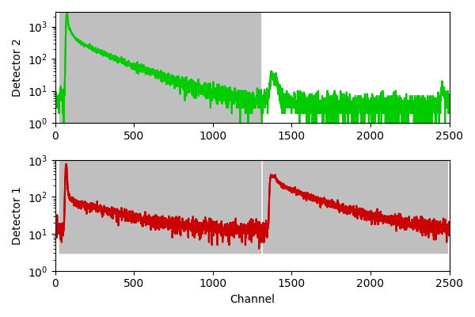

# PIE-smFRET-toolkit
Toolkit for single-molecule FRET (smFRET) experiments using Time-Correlated Single Photon Counting (TCSPC) data in PTU format (T3 data, PicoQuant). The scripts support pulsed-interleaved excitation (PIE) of two wavelengths and two detection channels, i.e., donor and acceptor excitations and corresponding detection channels. The measurement folder is supposed to contain multiple PTU files with only few minutes length, preferably 1Min length.

Required Python packages:

- numpy 
- matplotlib
- pandas
- openpyxl
- alive_progress

Usage:

Use the scripts according to there name in the order from S0 to S3. User input like, e.g., channel assignments or filter settings, is required in the parameter section in the beginning of each script.

S0: Defines the microtime windows of donor excitation donor/acceptor emission and acceptor excitation acceptor emission.
In order to load example data for window selection, a folder has to be specified in the parameter section. Furthermore, the number of the donor and acceptor channels have to be set.

S1: Extracts the background counts from the measurement files:

              BD ... average background intensity of the donor channel after donor excitation
              BA ... average background intensity of the acceptor channel after donor excitation
              BA0 ... average background intensity of the acceptor channel after acceptor excitation
              
Therefore, the measurement folder has to be specified and the settings file derived from script S0 has to be selected. Further settings are:

              BIN_T ... the bin time to calculate the time trace from the photon arrival times
              FRAC_T ... time trace part, which will be shown for background selection
              NUM_F ... number of files to be analyzed
              REG_F ... number of time trace regions per file for background estimation

If not existing the script creates a results folder and saves all information in a json-file with the name of the measurement folder starting with "BG_".              

S2: Analysis of the measured PTU files. Therefore, the measurement folder has to be specified and the settings file derived from script S0 has to be selected. Further settings are:

              BIN_T ... the bin time to calculate the time trace from the photon arrival times
              THRE_B ... lower intensity threshold for bin selection applied to the selected ALGORITHM
              ALGORITHM ... burst search algorithm to identify bins satisfying the THRE_B criterion
              MEAN_IRF_DONOR ... mean lifetime of the donor instrumental response function (IRF)
              MEAN_IRF_ACCEPTOR ... mean lifetime of the acceptor instrumental response function (IRF)

If not existing the script creates a results folder and saves all information in a json-file with the name of the measurement folder starting with "Results_".

S3: Visualization and export of the data analysis result. Therefore, the results path and results filename has to be specified. Further settings are:

 boolean settings for data export
 
              boolPNG ... if set to 1 plots and histograms will be export as PNG
              boolSVG ... if set to 1 plots and histograms will be export as SVG
              boolEXCEL ... if set to 1 the fluorescence parameter will be export in a Excel sheet

              ALPHA, BETA, and GAMMA ... correction factors for FRET

              TAU_D0 ... donor lifetime in the absence of the acceptor

filter settings

              NUM_PH ... minimal and maximal number of total photons
              BRD_S ... lower and upper threshold of stoichiometry filter
              BRD_ALEX2CDE ... lower and upper threshold of ALEX-2CDE filter
              BRD_E ... lower and upper threshold of stoichiometry filter
              BRD_FRET2CDE ... lower and upper threshold of FRET-2CDE filter
              RATIO_NGNR ... lower and upper threshold of NG/NR filter
              BRD_TAU_D ... lower and upper threshold of donor lifetime
              BRD_TAU_A ... lower and upper threshold of acceptor lifetime
